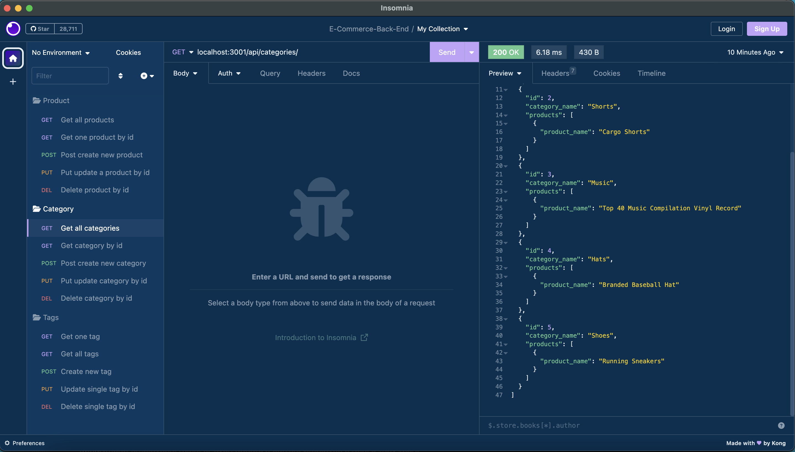

# E-Commerce-Back-End

Link to demo video:

https://drive.google.com/file/d/1Hys9QGVsNqNNueMzKcR6Kh_1IxXrS2zr/view?usp=sharing

## Description
MySql database and application backend for an e-commerce site using MySQL2, Sequelize, and Express. Users can use insomnia to perform CRUD operations to the database.

## Installation
- Run `npm init` and then `npm install` to install everything needed.

## Usage
To connect to the database and connect to the server, follow these steps: 

- Start with `mysql -u root` (-p at the end if you have a password).

- Run `source db/schema.sql`

- Run `use ecommerce_db`, and then type "quit"

- Next, type and enter `npm run seed`

- Finally, run `npm start`

## Contributing
N/A

## Questions?
Feel free to ask any questions you may have by reaching out to the following:

Github: https://github.com/Austin1094
Email: Austin.Adams1094@gmail.com